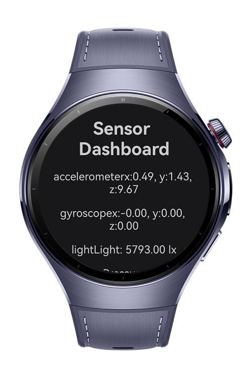
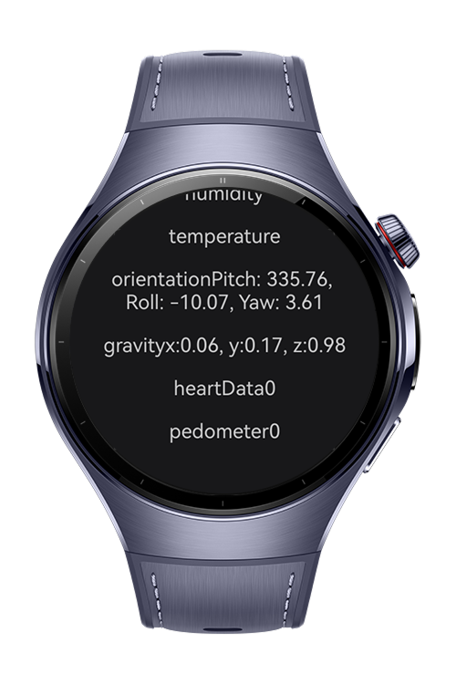
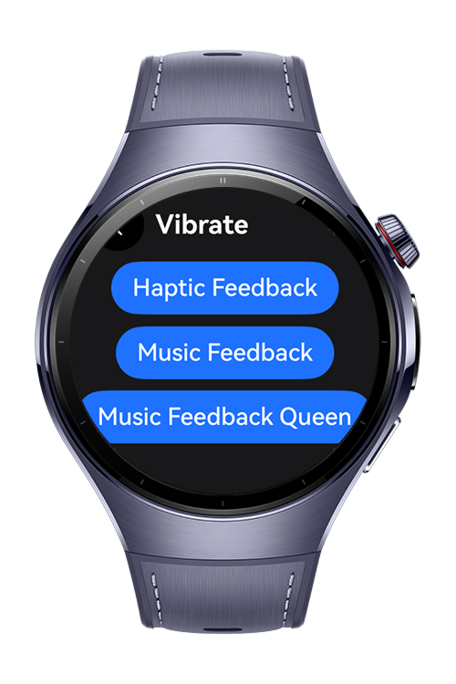

> **Note:** To access all shared projects, get information about environment setup, and view other guides, please visit [Explore-In-HMOS-Wearable Index](https://github.com/Explore-In-HMOS-Wearable/hmos-index).

# How To Use Sensor Kit In Wearable 

This project is a compact, developer-friendly showcase of HarmonyOS NEXT SensorKit and vibration (haptics) on wearables. It auto-detects which sensors your device actually exposes, requests and explains the required permissions, and streams live readings with units, timestamps, and sampling rates. A built-in haptics playground lets you trigger system patterns and custom sequences, so you can prototype on-wrist feedback and validate UX quickly. Perfect for demos, device bring-up, and debugging sensor availability across models.
# Preview

<div>
     
     
    
</div>
  
# Use Cases
A user raises their HarmonyOS NEXT smartwatch, opens a live sensor dashboard that auto-lists available hardware, taps to start accelerometer and heart-rate streams, and gets a crisp confirm buzz while real-time values roll in—permissions handled inline, no phone required.
# Tech Stack

- **Languages**: ArkTS
- **Frameworks**: HarmonyOS SDK 5.1.0(18)
- **Tools**: DevEco Studio Vers 5.1.0.842
- **Libraries**: @kit.ArkUI, @ohos.SensorServiceKit, @ohos.LocalizationKit

# Directory Structure
```
entry/src/main/ets/
 
    
|-- pages
|   |-- Index.ets                      
|   |-- Vibrate.ets                  
|-- utils
|   |-- PermissionUtil.ets    
|-- resources
|   |-- base
|   |-- dark 
|   |-- en_US    
|   |-- rawfile       
|   |   |-- MarchVibrate.json       
|   |   |-- stompClap.json       
|-- entryability/                     
|-- entrybackupability/              
```

# Constraints and Requirements
- **IDE**: DevEco Studio (≥ v5.1.0)
- **SDK**: HarmonyOS NEXT API Version 16+
- **Device**: Huawei Watch (e.g., Watch 5)
- **Permissions**:  'ohos.permission.ACCELEROMETER',
  'ohos.permission.ACTIVITY_MOTION',
  'ohos.permission.GYROSCOPE',
  'ohos.permission.READ_HEALTH_DATA'

# LICENSE

SensorKit Codelab is distributed under the terms of the MIT License.
See the [LICENSE](/LICENSE) for more information.